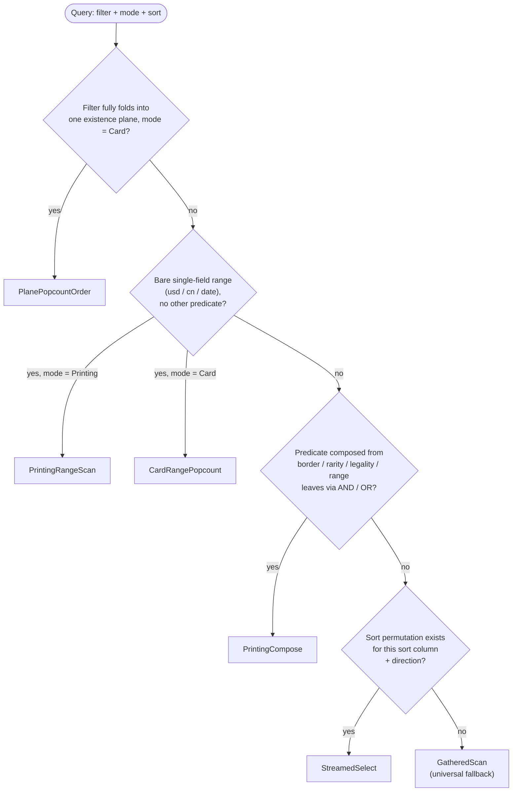

# The Six Physical Plans

`card_engine`'s router does not special-case queries. Every search resolves to one of six
`PhysicalPlan` variants ([card_engine/src/lib.rs:8138](../../card_engine/src/lib.rs#L8138)),
chosen by a plain argmin over a cost model. This doc catalogs the six plans: what each one
does, when it's legal to run, and how it's costed. For how the argmin itself works, see
[Plan Selection](#plan-selection) at the bottom.

## Summary

| Plan | Handles | Materializes? |
|---|---|---|
| [PrintingRangeScan](#printingrangescan) | bare range, `unique=printing` | no |
| [PrintingCompose](#printingcompose) | border/rarity/legality AND/OR, any `unique=` | no (only if it wins) |
| [PlanePopcountOrder](#planepopcountorder) | any predicate already folded into a card-existence plane | no (reads a plane already built) |
| [CardRangePopcount](#cardrangepopcount) | bare range, `unique=card` | builds a card bitmap at query time |
| [StreamedSelect](#streamedselect) | anything, given a sort permutation | no |
| [GatheredScan](#gatheredscan) | anything, unconditionally | no |

## Key Concepts

A few terms recur across every plan below:

- **Range index** — for a field like price or collector number, the engine keeps one sorted entry
  per *distinct* value, each pointing at every printing that has it (`PrintingValueIndex`,
  lib.rs:2944). A bound like `usd<50` is answered with two binary searches into this structure,
  which hand back one contiguous run of matching printings — no need to check printings one at a
  time just to find where the range starts and ends.
- **Narrowing** — before either general-purpose plan below (`StreamedSelect`, `GatheredScan`)
  checks a single card against the filter, an earlier step tries to shrink the list of cards worth
  checking at all, using whatever indexes the predicate's shape allows — the same range/plane/
  postings structures the specialized plans above read directly, just combined more generally
  (`prepare_candidates`/`narrow_rec`, lib.rs:8687). When narrowing succeeds, "loop over the
  candidates" means looping over that already-small list (`PreparedCandidates::card_ids`,
  lib.rs:8373); only a predicate narrowing can't help with at all falls through to a genuine
  full-corpus scan.
- **Sort permutation** — a precomputed visiting order for all cards under a given sort (e.g. "by
  EDHRec rank, descending"). Both directions are precomputed, so ascending and descending cost the
  same at query time — neither needs an extra reversal step. There are two mirror-image versions of
  it: the *forward* permutation answers "who's at position N" (used to walk cards out in order),
  and the *inverse* permutation answers "what position is card X at" (used to jump straight to a
  spot in the order instead of walking there).
- **Materializing** — building the entire list of matches, or a full yes/no bitmap over every card,
  before returning anything. A "non-materializing" plan skips that step: it walks the permutation
  or index directly and stops as soon as it has produced the one page of results the caller asked
  for.
- **Plane (bitmap)** — a precomputed one-bit-per-card yes/no answer to a predicate that would
  otherwise need re-checking row by row (e.g. "legal in Modern"). Built once, ahead of time, so a
  plan can test membership with a single bit read instead of re-evaluating the filter.

## PrintingRangeScan

**What it does:** walks cards out in the query's requested sort order (see Sort permutation above),
checking each one's printings against the range bound as it goes, and stops as soon as the page is
full — it never builds the full list of matches first (non-materializing). When the sort happens to
be by the range field itself (e.g. sorting by price while filtering on price), it skips the
per-card check entirely and reads the matching run straight out of the range index
(`printing_range_fastpath`). This only handles `unique=printing` queries — see `PrintingCompose`
and `CardRangePopcount` below for the other distinct-on modes.

**Applicable when** (`printing_range_scan_applicable`, lib.rs:8533): the `PRINTING_RANGE_FASTPATH`
flag is on, mode is `Printing`, there's no plane, the store is non-empty, and the filter is a bare
range (`bare_range_bounds` recognizes it — `usd`, `cn`, `date`, etc).

**Cost** (`cost.rs:750`): `printings_walked * RANGE_WALK_STEP_NS + RANGE_FIXED_COST_NS`. The total
comes straight from the range index's cardinality (`k`) — no popcount pass, no synthesis. Only the
walk to fill the page is charged.

## PrintingCompose

**What it does:** the general "combine several simple attributes into one bitmap" plan. For
predicates built out of border/rarity/legality combined with AND/OR, it builds one bitmap
expression over printings — once, regardless of whether
the query wants unique printings, unique cards, or unique artworks — then reshapes that bitmap to
match what was asked for (no reshaping needed for `unique=printing`; collapsed down to a per-card
existence bitmap for `card`/`artwork`) and pages through it (`printing_compose_fastpath`). It only
builds the bitmap if this plan actually wins the argmin, so a losing bid costs almost nothing.

**Applicable when** (`printing_compose_applicable`, lib.rs:8558): the `PRINTING_COMPOSE` flag is
on, the store is non-empty, the whole predicate (the `unsplit` filter when a plane is present,
otherwise the filter itself) is printing-composable, and the compose indexes are built.
`plane.is_none()` matters only when there *is* a plane and no `unsplit` — the presence of a plane
tells the router the predicate already folded into an existential card plane, which is
`PlanePopcountOrder`'s job instead.

**Paging is a 3-way internal choice** (`ComposePaging`, lib.rs:8163), because the three shapes cost
differently and the fastpath actually runs one of them:

- **`Perm`** — a sort permutation exists for the requested order, so it walks cards out in that
  order (`walk_grouped_page`), testing each one against the bitmap. Cost grows with how deep the
  page is (a page starting far into the results takes proportionally longer to reach).
- **`OrderbyWalk`** — no permutation, but the query is ordered by price or rarity, which the
  range index already has sorted — so it walks that index directly instead
  (`walk_range_orderby_page` / `walk_rarity_orderby_page`). Same depth-dependent cost shape as `Perm`.
- **`Gather`** — neither of the above applies, so it just visits every match once and collects them
  (`gather_composed_page`). Costs the same no matter how deep the requested page is, since there's
  no ordered structure to walk through first.
- **`Decline`** — the fastpath will refuse the query outright. Costed `f64::INFINITY` so it's
  never chosen; see [Plan Selection](#plan-selection) for why declining plans still need a finite
  cost model shape rather than being filtered out earlier.

**Cost** (`cost.rs:758`): `build` (legality broadcast + range-slice scatter + card/artwork
projection pass + popcount of the result bitmap) plus a `page` term that depends on which
`ComposePaging` variant the fastpath will pick, plus `COMPOSE_FIXED_COST_NS`. See
[reference-engine-compose-perm-cards-visited-estimator.md](reference-engine-compose-perm-cards-visited-estimator.md)
for how the estimator feeds this.

## PlanePopcountOrder

**What it does:** the predicate already has a precomputed card-existence plane bitmap (see Key
Concepts), so this plan can skip straight to the requested offset instead of walking match-by-match
to get there: it counts set bits ("popcounting") through the bitmap's words, word by word, until
it's counted past the offset, then emits one page from that point
(`run_query_streamed_popcount`). This is an index-skip-scan technique — like using a block's row
count to jump past whole pages of a B-tree instead of scanning every row — and it works because
counting bits in a 64-bit word is a single CPU instruction, so skipping is far cheaper than walking.
Nothing needs building at query time; the bitmap already exists.

**Applicable when** (`plane_popcount_order_applicable`, lib.rs:8514): the filter has been fully
consumed down to `FilterExpr::True` (i.e. the whole predicate folded into the plane), mode is
`Card`, the store is non-empty, a plane is present, and both the forward and inverse sort
permutations exist for `(sort_col, descending)`.

**Cost** (`cost.rs:802`): scatter matches through the inverse permutation, popcount the card bitmap
plus skip-scan to the offset, emit the page, plus fixed setup — no build term, since the bitmap is
already there. See
[reference-engine-compose-popcount-skip-topk-select.md](reference-engine-compose-popcount-skip-topk-select.md).

## CardRangePopcount

**What it does:** handles a bare range like `usd<50` under `unique=card`. There's no precomputed
plane for an arbitrary price cutoff — the cutoff value is different on every query, so it can't be
precomputed ahead of time the way "legal in Modern" can. So this plan builds a one-off
card-existence bitmap on the spot from the matching range-index slice, then uses the same
popcount-skip technique as `PlanePopcountOrder` to page through it
(`exec_card_range_popcount`).

**Applicable when** (`card_range_popcount_applicable`, lib.rs:8606): the `RANGE_BITS_CARD` flag is
on, mode is `Card`, the store is non-empty, there's no plane, the filter is a bare range leaf
(`bare_range_bounds`), and both sort permutations exist. `plane.is_none()` is deliberate on two
grounds:

- **Correctness** — a legality predicate like `f:modern` or `f:commander` (`usd<50 f:modern`) is
  excluded no matter which format it names, including one that never actually diverges across
  printings in the real data. A card-existence AND is only exact when a format's legality can't
  disagree between two printings of the same card, and on the real corpus that's true for every
  format except `oldschool` ([00667](done/00667-engine-legality-divergent-carveout.md)) — but the
  engine doesn't check that per query. Every format's legality compiles to the same
  precomputed-existence-plane representation unconditionally
  (`FilterExpr::Legality => PlaneExpr::Plane(...)`, planes.rs:1306), whether or not that particular
  format happens to be divergence-free this month. So the exclusion here is structural, keyed off
  "this is a legality predicate," not a per-query judgment about whether *this* format's plane is
  actually safe to skip.
- **Performance** — every *other* plane (color, type, rarity, border — anything the engine treats
  as genuinely card-invariant) is excluded for an unrelated reason that has nothing to do with the
  specific predicate's selectivity. A narrow one (`c:g`, a small slice of the corpus) and a broad
  one (`t:creature`, a much larger slice) are both excluded the same way, and both stay fast without
  this plan's help — because having *any* plane means the query already has a precomputed bitmap to
  compose the range against, and composing two bitmaps costs time proportional to the corpus's
  size, not to how many cards actually match. `CardRangePopcount` exists for the opposite
  situation — a bare range with *no* plane at all, where there's no existing bitmap to lean on, so
  building one from scratch is worth it. Adding this plan to plane-present queries was measured as a
  net loss, narrow or broad alike.

The bare-leaf requirement also excludes range-AND-range (`usd<50 cn<100`): composing two
printing-varying ranges is a shared-witness case that must AND in printing space, which is
`PrintingCompose`'s job.

**Cost** (`cost.rs:810`): `CardRangePopcount`'s own build term (a fused one-pass scatter+project of
the range slice straight into card bits) plus `PlanePopcountOrder`'s walk terms unchanged.

## StreamedSelect

**What it does:** the general "I have a sort permutation, use it" plan (`run_query_streamed`). It
doesn't care whether the predicate is one of the special shapes the plans above require — it walks
cards out in sort order, checks each against the filter, and stops once the page fills. This is the
plan for arbitrary predicates that still have a permutation to walk.

**Applicable when** (`streamed_select_applicable`, lib.rs:8502): the store is non-empty and a
forward+inverse permutation pair exists for `(sort_col, descending, cards.len())`. Breadth
(`maybe_broad`) is deliberately *not* a correctness gate — StreamedSelect returns correct rows at
any selectivity; breadth only affects whether it *wins* the cost comparison.

**Cost** (`cost.rs:857`): two regimes, mirroring the executor's own guard. Below
`STREAM_MIN_MATCHES`, `run_query_streamed` falls back to a small-total gather that scans all
`n_cards` (an O(N) floor). Above it, the walk steps the permutation until the page fills,
`~(page_span * n_cards / matches)` entries, assuming uniform spread. Both regimes add a
per-candidate loop cost gated on whether a residual filter needs checking (`tier_ns > 0`), plus
fixed setup.

## GatheredScan

**What it does:** the universal fallback — for whatever's left once every specialized plan above
declines. It doesn't require a sort permutation, an index, or a precomputed bitmap of its own; it
just needs *a* list of cards to check one at a time, which it gets from narrowing (see Key
Concepts). Most of the work is usually already done by the time this plan's loop starts: it
checks each remaining candidate against the filter, collects the matches, and slices out the
requested page (`select_page`). Only when the predicate's shape defeats narrowing entirely does
this become a genuine full-corpus scan. Slower than the specialized plans regardless, since it
checks the filter row by row instead of reading a precomputed answer, but always correct, no
matter how unusual the predicate, mode, or available structures are.

**Applicable when** (`gathered_scan_applicable`, lib.rs:8491): unconditionally `true`. This is
what guarantees the argmin is never empty — every other plan can decline, but this one can't.

**Cost** (`cost.rs:882`): a per-candidate loop cost (gated on residual checking, same shape as
`StreamedSelect`) scaled by `eval_domain` — the size of the list narrowing left it with, not
necessarily the full corpus — plus a scan term, a push-per-match term, and page-selection/
collection terms. No permutation-walk term — it doesn't use one.

## Plan Selection

There's no hand-written decision tree. `run_query_routed`'s `choose` closure
(lib.rs:10732) is a generic argmin:

```
PhysicalPlan::ALL
    .filter(|p| p.applicable(...) && scope.admits(*p))
    .min_by(|a, b| plan_cost(a) <=> plan_cost(b))
```

Two things are deliberately kept separate: `applicable()` is a pure correctness predicate (can
this plan even answer this query), and `plan_cost()` is a pure performance estimate (how long will
it take). A plan is never excluded from the argmin because it's estimated to be slow — only
because it's estimated to be *infinitely* slow (`Decline`) or because it's outside the current
`PlanScope`.

**An approximate picture.** The flowchart below is *not* what the code does — there's no early
return, and several branches can be simultaneously true for one query (a bare range with a sort
permutation is `PrintingRangeScan`-, `StreamedSelect`-, and `GatheredScan`-applicable all at once).
It's a rough map of which specialized plan *usually* turns out cheapest for each query shape, useful
for orientation before falling back to "it's really an argmin" above:



**`PlanScope`** (lib.rs:8428) restricts the argmin to what the caller's acquire step can actually
dispatch to, without re-materializing:

- `Prep::Range` → `PlanScope::All` — the range-index acquire is cheap enough to cost all six
  up front.
- `Prep::Plane` → `PlanScope::Plane` — admits `PlanePopcountOrder` plus the two candidate-list
  plans, since a plane bitmap doubles as a candidate list.
- `Prep::Candidates` → `PlanScope::Candidates` — admits only `StreamedSelect`/`GatheredScan`
  (`CandidatePlan`, lib.rs:8265), the two plans that can run off an already-materialized list.

This is what makes `GatheredScan` reachable as a true fallback in every scope, rather than an
`unreachable!()` the executor hopes never fires.

**Calibration and validation.** The nanosecond constants in `cost.rs` are fit against a real-corpus
benchmark (`fit_cost_model.py`) so the argmin reproduces the empirically fastest ("gold") plan per
query/mode/depth. Selection quality is checked continuously via a *regret* metric — `regret =
measured_ns[picked] / measured_ns[gold]` — computed by `scripts/bench_regret_matrix.py` and
exercised in tests like `plan_regret_report` / `plan_cost_model_matches_gold`. Changes to cost
constants must not regress total measured regret before landing. See
[reference-cost-model-measurement.md](reference-cost-model-measurement.md) for the measurement
methodology.
